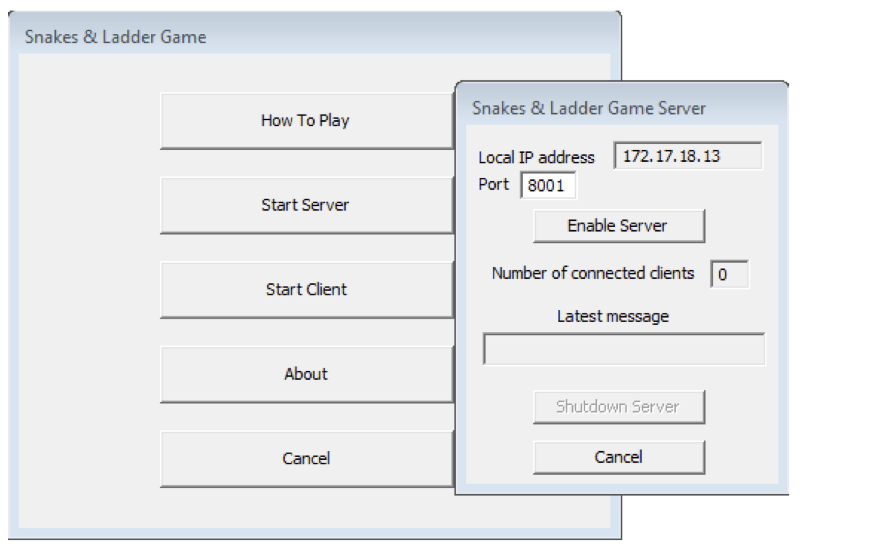
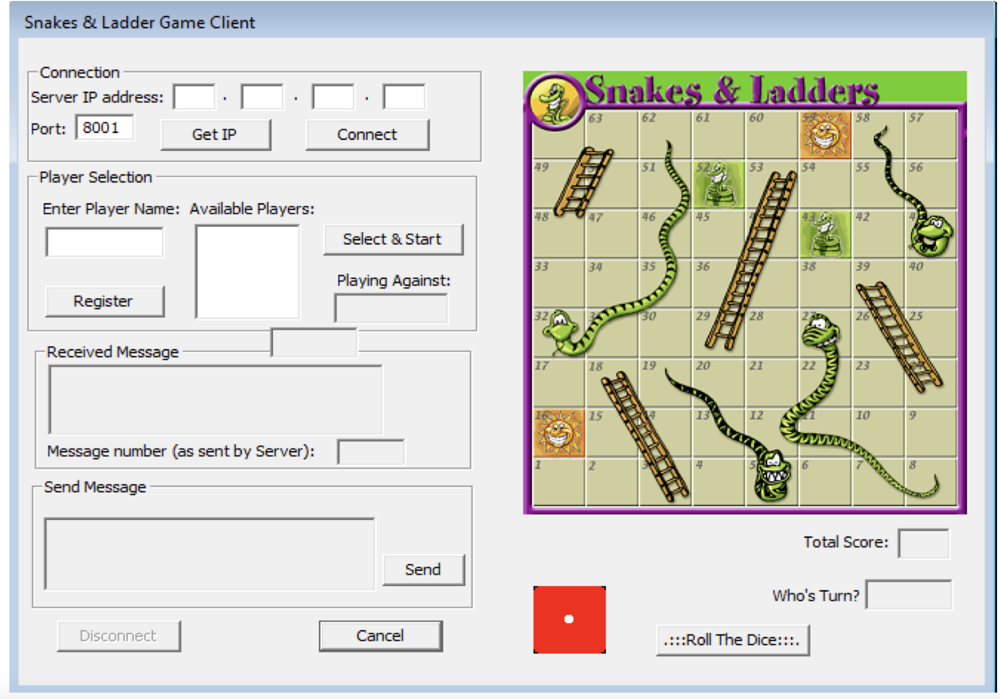

<!-- PROJECT LOGO -->
 

  

<h3 align="center">Snakes and Ladder </h3>

  

     
    <a href="https://github.com/EQITechG/Snakes_And_Ladder"><strong>Explore Repo »</strong></a>
     
    <a href="https://drive.google.com/file/d/1kcnb1Zl-Gk08B9sc6_5_mrI_uN16NvjN/view?usp=sharing">View Demo</a>
    ·
    <a href="https://github.com/EQITechG/Snakes_And_Ladder/issues">Report Bug</a>
    ·
  

<!-- TABLE OF CONTENTS -->

  
Table of Contents

  <ol>
    <li>
      <a href="#about-the-project">About The Project</a>
      <ul>
        <li><a href="#usage">Usage</a></li>
        <li><a href="#built-with">Built With</a></li>
      </ul>
    </li>
    <li>
      <a href="#getting-started">Getting Started</a>
      <ul>
        <li><a href="#installation">Installation</a></li>
      </ul>
    </li>
  </ol>

<!-- ABOUT THE PROJECT -->
## About The Project

A two player snakes and ladder game over TCP with a server side and a client side.

<!-- USAGE EXAMPLES -->
## Usage

The exe file can be downloaded from the from url

Once another player has done the same thing on their on computer

Then Bob is your uncle!

### Built With

* C++

<!-- GETTING STARTED -->
## Getting Started

Clone repo [https://github.com/EQITechG/Snakes_And_Ladder.git](https://github.com/EQITechG/Snakes_And_Ladder.git)

### Installation

================================================================================
    MICROSOFT FOUNDATION CLASS LIBRARY : TCP_Snakes_And_Ladder Project Overview 
===============================================================================

TCPDemonstrator_VS2008.vcproj
    This is the main project file for VC++ projects generated using an application wizard.
    It contains information about the version of Visual C++ that generated the file, and
    information about the platforms, configurations, and project features selected with the
    application wizard.

TCPDemonstrator_VS2008.h
    This is the main header file for the application.  It includes other
    project specific headers (including Resource.h) and declares the
    CTCPDemonstrator_VS2008App application class.

TCPDemonstrator_VS2008.cpp
    This is the main application source file that contains the application
    class CTCPDemonstrator_VS2008App.

TCPDemonstrator_VS2008.rc
    This is a listing of all of the Microsoft Windows resources that the
    program uses.  It includes the icons, bitmaps, and cursors that are stored
    in the RES subdirectory.  This file can be directly edited in Microsoft
    Visual C++. Your project resources are in 1033.

res\TCPDemonstrator_VS2008.ico
    This is an icon file, which is used as the application's icon.  This
    icon is included by the main resource file TCPDemonstrator_VS2008.rc.

res\TCPDemonstrator_VS2008.rc2
    This file contains resources that are not edited by Microsoft
    Visual C++. You should place all resources not editable by
    the resource editor in this file.

/////////////////////////////////////////////////////////////////////////////

The application wizard creates one dialog class:

TCPDemonstrator_VS2008Dlg.h, TCPDemonstrator_VS2008Dlg.cpp - the dialog
    These files contain your CTCPDemonstrator_VS2008Dlg class.  This class defines
    the behavior of your application's main dialog.  The dialog's template is
    in TCPDemonstrator_VS2008.rc, which can be edited in Microsoft Visual C++.

/////////////////////////////////////////////////////////////////////////////

Other Features:

ActiveX Controls
    The application includes support to use ActiveX controls.

Windows Sockets
    The application has support for establishing communications over TCP/IP networks.

/////////////////////////////////////////////////////////////////////////////

Other standard files:

StdAfx.h, StdAfx.cpp
    These files are used to build a precompiled header (PCH) file
    named TCPDemonstrator_VS2008.pch and a precompiled types file named StdAfx.obj.

Resource.h
    This is the standard header file, which defines new resource IDs.
    Microsoft Visual C++ reads and updates this file.

TCPDemonstrator_VS2008.manifest
	Application manifest files are used by Windows to describe an applications
	dependency on specific versions of Side-by-Side assemblies. The loader uses this
	information to load the appropriate assembly from the assembly cache or private
	from the application. The Application manifest  maybe included for redistribution
	as an external .manifest file that is installed in the same folder as the application
	executable or it may be included in the executable in the form of a resource.
/////////////////////////////////////////////////////////////////////////////

